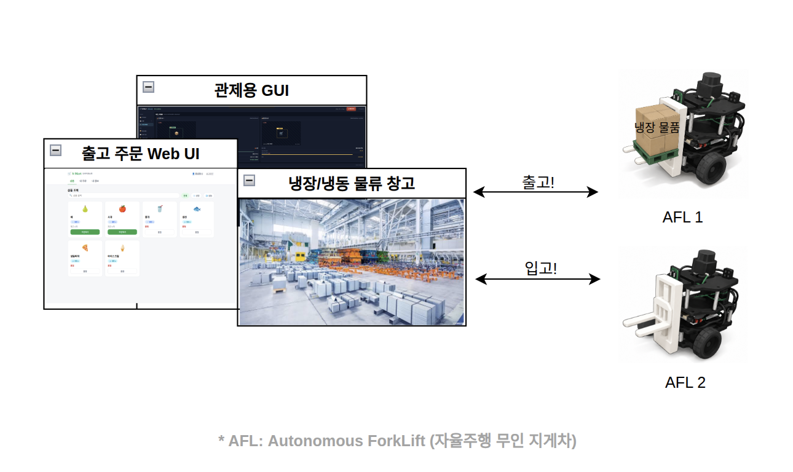
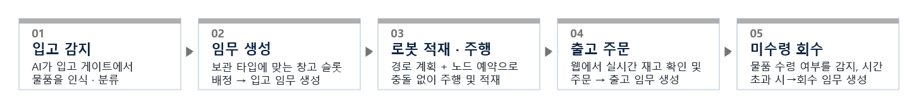
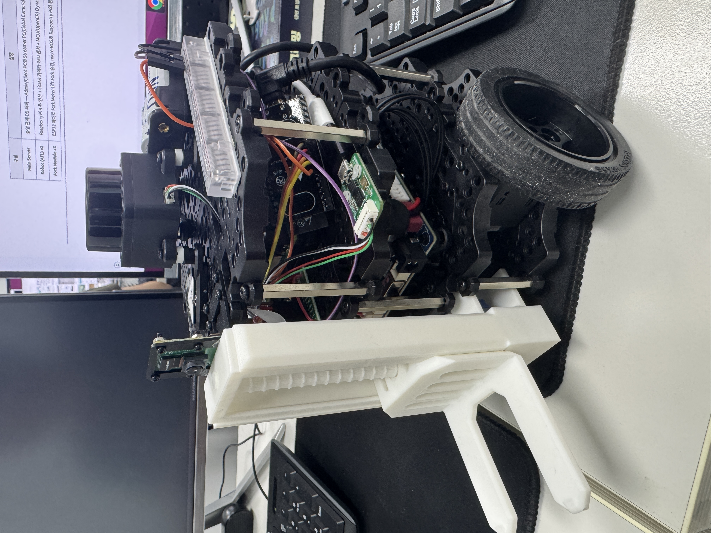
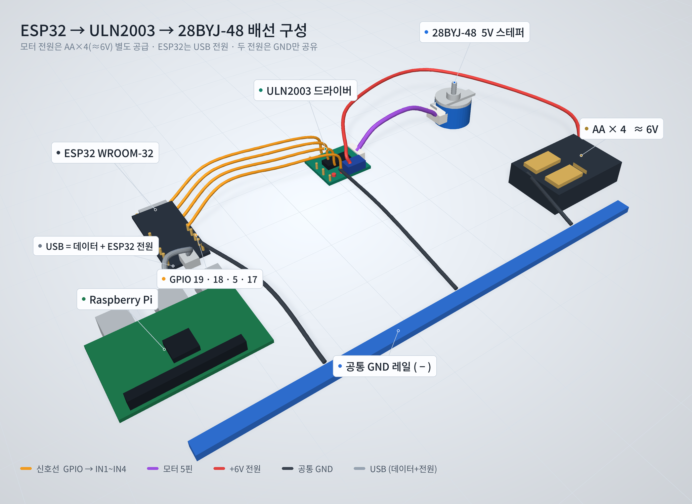
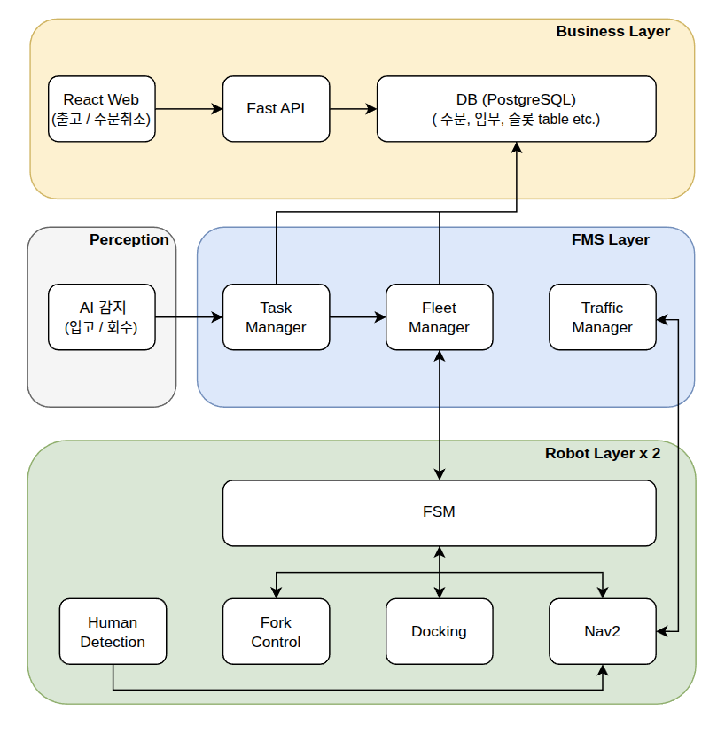
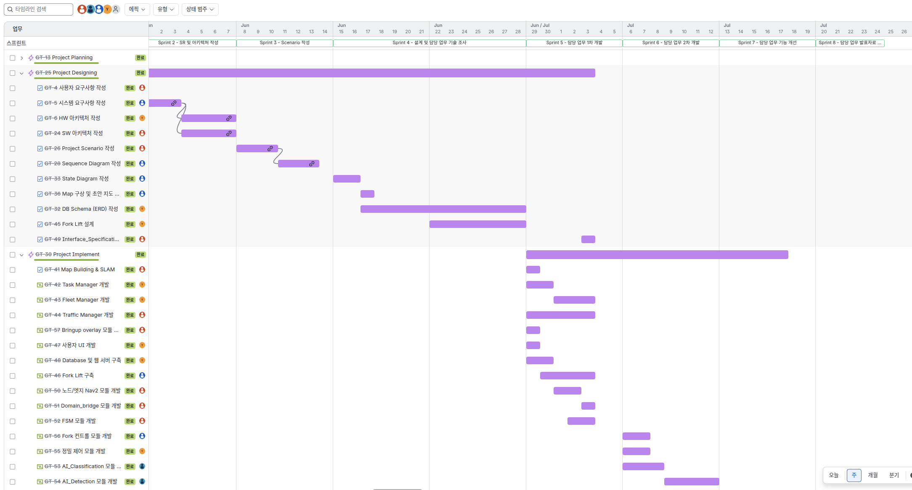
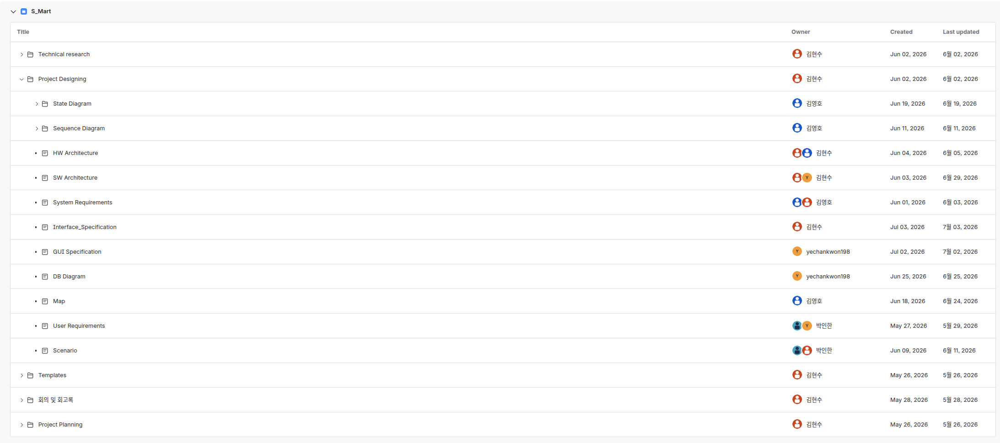

<h1 align="center" style="border-bottom: none;">멀티 AFL 기반 콜드체인 물류 자동화 시스템</h1>

<p align="center">
  
</p>

> 멀티 자율주행 포크리프트(AFL, Autonomous Forklift)가 **물품별로 냉장/냉동 창고에 자동 입출고 임무**를 수행하는 스마트 물류창고 시스템.

<hr style="height: 3px; border: none; background-color: #c4c4c4;">

<h2 align="center" style="border-bottom: none;">🎬 최종 시연 영상</h2>

<p align="center">
  <a href="https://www.youtube.com/watch?v=2CFEhwQnVaI">
    
  </a>
</p>

<p align="center"><sub>▶ 이미지를 클릭하면 YouTube로 이동합니다</sub></p>

<hr style="height: 3px; border: none; background-color: #c4c4c4;">

<h2 style="border-bottom: none;">📑 목차</h2>

- [1. 프로젝트 개요](#-1-프로젝트-개요)
- [2. 하드웨어 구성](#-2-하드웨어-구성)
- [3. 시스템 구성](#-3-시스템-구성)
- [4. 패키지 구성](#-4-패키지-구성)
- [5. 설치 및 실행 방법](#-5-설치-및-실행-방법)
- [6. 협업 환경](#-6-협업-환경)

<hr style="height: 3px; border: none; background-color: #c4c4c4;">

<h2 id="-1-프로젝트-개요" style="border-bottom: none;">1. 프로젝트 개요</h2>

### 📅 개발 기간

<table style="border-collapse: collapse;">
  <tr>
    <td align="center" style="border: 2px solid #c4c4c4; padding: 6px 16px;"><b>개발 기간</b></td>
    <td align="center" style="border: 2px solid #c4c4c4; padding: 6px 16px;">2026.05.26 ~ 2026.07.24</td>
  </tr>
</table>

### 💡 기획 의도

<table style="border-collapse: collapse;">
  <tr>
    <td align="center" style="border: 2px solid #c4c4c4; padding: 8px 16px; background-color: #f0f0f0;">📈 <b>2025년 글로벌 AGV·AMR 출하량, 전년 대비 17.7% 증가</b></td>
  </tr>
  <tr>
    <td style="border: 2px solid #c4c4c4; padding: 8px 16px;">2025년 글로벌 AGV·AMR 시장은 <b>286,235대</b>로 전망되며, 전년 대비 <b>17.7% 증가</b>할 것으로 예상</td>
  </tr>
  <tr>
    <td style="border: 2px solid #c4c4c4; padding: 8px 16px;"><b>인력 부족</b>과 <b>물류 자동화 수요 확대</b>가 주요 성장 요인으로 분석</td>
  </tr>
</table>

### 🎯 프로젝트 목표

<table style="border-collapse: collapse;">
  <tr>
    <td style="border: 2px solid #c4c4c4; padding: 8px 16px;">AI가 물품을 인식하고, <b>멀티 로봇</b>이 <b>품목별로 냉장/냉동 창고</b>에 입·출고를 자동 처리하는 <b>콜드체인 물류 자동화 시스템</b></td>
  </tr>
</table>

### ✨ 프로젝트 핵심 기능

<table style="border-collapse: collapse;">
  <tr>
    <td align="center" style="border: 2px solid #c4c4c4; padding: 8px 16px; background-color: #f0f0f0;"><b>기능</b></td>
    <td align="center" style="border: 2px solid #c4c4c4; padding: 8px 16px; background-color: #f0f0f0;"><b>설명</b></td>
  </tr>
  <tr>
    <td style="border: 2px solid #c4c4c4; padding: 8px 16px;">🔍 <b>AI 입고 분류 및 출고 감지</b></td>
    <td style="border: 2px solid #c4c4c4; padding: 8px 16px;">Vision AI가 입고 게이트에서 물품을 인식(분류)하고, 출고 게이트에서는 물품의 실제 출고 여부를 감지</td>
  </tr>
  <tr>
    <td style="border: 2px solid #c4c4c4; padding: 8px 16px;">🛒 <b>실시간 재고 반영 출고 주문</b></td>
    <td style="border: 2px solid #c4c4c4; padding: 8px 16px;">웹에서 실시간 재고 확인 및 출고 주문 → 출고 임무 자동 생성, 재고 상태가 중앙 DB에 즉시 반영</td>
  </tr>
  <tr>
    <td style="border: 2px solid #c4c4c4; padding: 8px 16px;">🤖 <b>멀티 로봇 임무 수행</b></td>
    <td style="border: 2px solid #c4c4c4; padding: 8px 16px;">FMS가 임무를 로봇에 할당·배정, 그래프(노드/엣지) 기반 경로 계획 + 노드 예약 관리(충돌 방지 및 교착 해결), 입고/출고/회수/주문취소 수행</td>
  </tr>
  <tr>
    <td style="border: 2px solid #c4c4c4; padding: 8px 16px;">📊 <b>실시간 관제</b></td>
    <td style="border: 2px solid #c4c4c4; padding: 8px 16px;">관제 GUI로 로봇 위치·임무 진행·재고·슬롯 상태를 실시간 모니터링</td>
  </tr>
  <tr>
    <td style="border: 2px solid #c4c4c4; padding: 8px 16px;">🧊 <b>미수령 상품 회수 (콜드체인 물류)</b></td>
    <td style="border: 2px solid #c4c4c4; padding: 8px 16px;">신선도 유지를 위해 상품(온도대)별 타임아웃을 적용하고 AI가 실제 출고 여부를 감지, 시간 내 미수령 시 상품을 회수하여 보관 창고로 재입고</td>
  </tr>
</table>

### 🔄 동작 시나리오



### 👥 팀원 소개

<table style="border-collapse: collapse;">
  <tr>
    <td align="center" width="150" style="border: 2px solid #c4c4c4; padding: 8px 16px; background-color: #f0f0f0;"><b>이름</b></td>
    <td align="center" style="border: 2px solid #c4c4c4; padding: 8px 16px; background-color: #f0f0f0;"><b>담당</b></td>
  </tr>
  <tr>
    <td align="center" style="border: 2px solid #c4c4c4; padding: 8px 16px;"><b>김현수(팀장)</b></td>
    <td style="border: 2px solid #c4c4c4; padding: 8px 16px;">멀티 로봇 경로 계획 및 제어, Navigation Stack 구축, BT 설계 및 커스텀 플러그인 개발, 로봇 상태머신 FSM 설계</td>
  </tr>
  <tr>
    <td align="center" style="border: 2px solid #c4c4c4; padding: 8px 16px;"><b>권예찬(팀원)</b></td>
    <td style="border: 2px solid #c4c4c4; padding: 8px 16px;">중앙 관제 시스템 아키텍처 설계 (DB, 임무 할당), ArUco 정밀 제어, 포크리프트 제어 (3rd Party Device 연동)</td>
  </tr>
  <tr>
    <td align="center" style="border: 2px solid #c4c4c4; padding: 8px 16px;"><b>김영호(팀원)</b></td>
    <td style="border: 2px solid #c4c4c4; padding: 8px 16px;">Fork Lift 하드웨어 설계, 관제 GUI & 사용자 UI 개발</td>
  </tr>
  <tr>
    <td align="center" style="border: 2px solid #c4c4c4; padding: 8px 16px;"><b>박인한(팀원)</b></td>
    <td style="border: 2px solid #c4c4c4; padding: 8px 16px;">AI 비전 모델 학습 (입/출고 물품 인식 모델, 사람 감지 모델)</td>
  </tr>
</table>

<hr style="height: 3px; border: none; background-color: #c4c4c4;">

<h2 id="-2-하드웨어-구성" style="border-bottom: none;">2. 하드웨어 구성</h2>

HW는 **turtlebot3_burger 2대** + **Fork Lift** 모듈로 구성

<h3 align="center">TurtleBot3 Burger</h3>

<p align="center">
  
</p>

<div align="center">
<table style="border-collapse: collapse;">
  <tr>
    <td align="center" style="border: 2px solid #c4c4c4; padding: 8px 16px; background-color: #f0f0f0;"><b>구성 요소</b></td>
    <td align="center" style="border: 2px solid #c4c4c4; padding: 8px 16px; background-color: #f0f0f0;"><b>사양</b></td>
  </tr>
  <tr>
    <td align="center" style="border: 2px solid #c4c4c4; padding: 8px 16px;"><b>SBC</b></td>
    <td style="border: 2px solid #c4c4c4; padding: 8px 16px;">Raspberry Pi 4</td>
  </tr>
  <tr>
    <td align="center" style="border: 2px solid #c4c4c4; padding: 8px 16px;"><b>MCU</b></td>
    <td style="border: 2px solid #c4c4c4; padding: 8px 16px;">OpenCR (IMU 내장)</td>
  </tr>
  <tr>
    <td align="center" style="border: 2px solid #c4c4c4; padding: 8px 16px;"><b>구동부</b></td>
    <td style="border: 2px solid #c4c4c4; padding: 8px 16px;">Dynamixel XL430-W250 ×2</td>
  </tr>
  <tr>
    <td align="center" style="border: 2px solid #c4c4c4; padding: 8px 16px;"><b>LiDAR</b></td>
    <td style="border: 2px solid #c4c4c4; padding: 8px 16px;">360° LDS-03</td>
  </tr>
  <tr>
    <td align="center" style="border: 2px solid #c4c4c4; padding: 8px 16px;"><b>카메라</b></td>
    <td style="border: 2px solid #c4c4c4; padding: 8px 16px;">Pi Camera2</td>
  </tr>
  <tr>
    <td align="center" style="border: 2px solid #c4c4c4; padding: 8px 16px;"><b>배터리</b></td>
    <td style="border: 2px solid #c4c4c4; padding: 8px 16px;">LiPo 11.1V</td>
  </tr>
</table>
</div>

<h3 align="center">Fork Lift 모듈</h3>

<p align="center">
  
</p>

<div align="center">
<table style="border-collapse: collapse;">
  <tr>
    <td align="center" style="border: 2px solid #c4c4c4; padding: 8px 16px; background-color: #f0f0f0;"><b>구성 요소</b></td>
    <td align="center" style="border: 2px solid #c4c4c4; padding: 8px 16px; background-color: #f0f0f0;"><b>사양</b></td>
  </tr>
  <tr>
    <td align="center" style="border: 2px solid #c4c4c4; padding: 8px 16px;"><b>제어 MCU</b></td>
    <td style="border: 2px solid #c4c4c4; padding: 8px 16px;">ESP32 WROOM-32 (micro-ROS로 Raspberry Pi와 시리얼 통신)</td>
  </tr>
  <tr>
    <td align="center" style="border: 2px solid #c4c4c4; padding: 8px 16px;"><b>모터 드라이버</b></td>
    <td style="border: 2px solid #c4c4c4; padding: 8px 16px;">ULN2003</td>
  </tr>
  <tr>
    <td align="center" style="border: 2px solid #c4c4c4; padding: 8px 16px;"><b>구동 모터</b></td>
    <td style="border: 2px solid #c4c4c4; padding: 8px 16px;">28BYJ-48 스테퍼 모터 (5V) — 포크 승강 구동</td>
  </tr>
  <tr>
    <td align="center" style="border: 2px solid #c4c4c4; padding: 8px 16px;"><b>모터 전원</b></td>
    <td style="border: 2px solid #c4c4c4; padding: 8px 16px;">AA 건전지 ×4 (≈6V, 별도 공급 · GND만 공유)</td>
  </tr>
  <tr>
    <td align="center" style="border: 2px solid #c4c4c4; padding: 8px 16px;"><b>제어 핀</b></td>
    <td style="border: 2px solid #c4c4c4; padding: 8px 16px;">GPIO 19 · 18 · 5 · 17 → IN1~IN4</td>
  </tr>
</table>
</div>

<hr style="height: 3px; border: none; background-color: #c4c4c4;">

<h2 id="-3-시스템-구성" style="border-bottom: none;">3. 시스템 구성</h2>

소프트웨어는 **3개 계층**으로 구성

<h3 align="center">SW 아키텍처</h3>

<p align="center">
  
</p>

<div align="center">
<table style="border-collapse: collapse;">
  <tr>
    <td align="center" style="border: 2px solid #c4c4c4; padding: 8px 16px; background-color: #f0f0f0;"><b>계층</b></td>
    <td align="center" style="border: 2px solid #c4c4c4; padding: 8px 16px; background-color: #f0f0f0;"><b>역할</b></td>
  </tr>
  <tr>
    <td align="center" style="border: 2px solid #c4c4c4; padding: 8px 16px;"><b>Business Layer</b></td>
    <td style="border: 2px solid #c4c4c4; padding: 8px 16px;">고객 주문, 상품 재고 등을 관리하는 <b>수요 발생 계층</b></td>
  </tr>
  <tr>
    <td align="center" style="border: 2px solid #c4c4c4; padding: 8px 16px;"><b>FMS Layer</b></td>
    <td style="border: 2px solid #c4c4c4; padding: 8px 16px;">수요를 임무로 바꿔 함대를 조율하는 <b>중간 계층</b></td>
  </tr>
  <tr>
    <td align="center" style="border: 2px solid #c4c4c4; padding: 8px 16px;"><b>Robot Layer</b></td>
    <td style="border: 2px solid #c4c4c4; padding: 8px 16px;">배정된 임무를 로봇이 실제 수행하는 <b>임무 실행 계층</b></td>
  </tr>
</table>
</div>

<p align="center"><sub><i>* Perception(인지)은 별도 계층이 아니라, 입고·회수 물품과 사람을 감지해 각 계층에 입력을 제공하는 기능 영역.</i></sub></p>
<p align="center"><sub><i>* 각 모듈별 상세 기능은 아래 4. 패키지 구성에서 소개</i></sub></p>

<hr style="height: 3px; border: none; background-color: #c4c4c4;">

<h2 id="-4-패키지-구성" style="border-bottom: none;">4. 패키지 구성</h2>

ROS 2 패키지는 `src/S_Mart/` 아래에 있으며, **패키지 이름을 클릭하면 해당 패키지의 상세 README(폴더)로 이동**한다.

<pre style="line-height:1.5;">
src/S_Mart/               ROS 2 패키지 (서버 도메인 12 · 로봇 30/31)
├─ <a href="src/S_Mart/robot_fsm">robot_fsm/</a>             임무 상태머신(FSM) — 임무 수행을 위한 각 기능 실행기
├─ <a href="src/S_Mart/smart_nav_bringup">smart_nav_bringup/</a>     Nav2 자율주행 스택 (파라미터·Localization·커스텀 BT)
├─ <a href="src/S_Mart/smart_bt_plugins">smart_bt_plugins/</a>      커스텀 Nav2 BT 플러그인 (사람 감지 시 안전 정지)
├─ <a href="src/S_Mart/smart_robot_bringup">smart_robot_bringup/</a>   로봇 하드웨어 브링업 (TB3 + EKF + camera)
├─ <a href="src/S_Mart/aruco_docking">aruco_docking/</a>         ArUco 마커 인식 + 정밀 도킹 제어
├─ <a href="src/S_Mart/human_detector">human_detector/</a>        카메라 사람 감지 → /human_stop 발행
├─ <a href="src/S_Mart/smart_domain_bridge">smart_domain_bridge/</a>   도메인 12(server) ↔ 30/31(robot1,2) 토픽 중계
├─ <a href="src/S_Mart/traffic_manager">traffic_manager/</a>       그래프 기반 경로 계획(다익스트라) + 노드 예약·교착 조율
├─ <a href="src/S_Mart/task_manager">task_manager/</a>          Web, AI로부터 → 입고/출고/회수 임무 생성 및 주문 취소 처리
├─ <a href="src/S_Mart/fleet_manager">fleet_manager/</a>         로봇 임무 배정 + DB 임무 상태 전환
├─ <a href="src/S_Mart/ai_detector">ai_detector/</a>           AI 입고/출고 물품 감지 (임무 트리거)
├─ <a href="src/S_Mart/smart_gui">smart_gui/</a>             PyQt5 관제 대시보드
├─ <a href="src/S_Mart/Gazebo/smart_sim_bringup">smart_sim_bringup/</a>     Gazebo 멀티 로봇 시뮬레이션
└─ <a href="src/S_Mart/smart_bringup">smart_bringup/</a>         통합 런치 폴더

<a href="client">client/</a>                   사용자 웹 (React + Vite + TypeScript) 
<a href="server">server/</a>                   백엔드 API (FastAPI + PostgreSQL)
<a href="firmware/fork_esp32">firmware/fork_esp32/</a>      포크리프트 ESP32 펌웨어 (micro-ROS)
</pre>

<hr style="height: 3px; border: none; background-color: #c4c4c4;">

<h2 id="-5-설치-및-실행-방법" style="border-bottom: none;">5. 설치 및 실행 방법</h2>

> **환경 (사전 설치)**: ROS 2 Jazzy · Python 3 · PostgreSQL · Node.js

### 🛠️ 설치

**1. 소스 준비 & 빌드**

> **서드파티 소스** — turtlebot3 · DynamixelSDK 등은 [`ros2_ai_amr.repos`](ros2_ai_amr.repos)로 **버전(커밋) 고정** → 본 프로젝트와 동일 버전 설치.

> **ROS 의존성** — 각 `package.xml`에 선언된 의존성을 **`rosdep`이 자동 설치** → 설치 목록은 [`rosdep-dependencies.md`](rosdep-dependencies.md) 참고.

```bash
# 서드파티 의존성 가져오기 (.repos에 핀 고정된 버전으로 clone)
vcs import src < ros2_ai_amr.repos
rosdep install --from-paths src --ignore-src -r -y

colcon build --symlink-install
source install/setup.bash
```

**2. 데이터베이스 (PostgreSQL)**

```bash
# 접속 정보: DB=s_mart / USER=codelab / PW=codelab  (server/app/database.py)
sudo -u postgres psql -c "CREATE USER codelab WITH PASSWORD 'codelab';"
sudo -u postgres psql -c "CREATE DATABASE s_mart OWNER codelab;"
# 테이블은 백엔드 최초 기동 시 자동 생성 (Base.metadata.create_all)
```

**3. 백엔드 · 웹 의존성**

```bash
cd server && pip install -r requirements.txt    # 백엔드 Python 패키지
cd client && npm install                         # 웹 패키지
```

**4. micro-ROS Agent (포크 ESP32 통신)**

```bash
# 별도 워크스페이스에서 micro-ROS 빌드 도구로 Agent 빌드
mkdir -p ~/microros_ws && cd ~/microros_ws
git clone -b jazzy https://github.com/micro-ROS/micro_ros_setup.git src/micro_ros_setup
rosdep install --from-paths src --ignore-src -y
colcon build && source install/setup.bash
ros2 run micro_ros_setup create_agent_ws.sh
ros2 run micro_ros_setup build_agent.sh
```

**5. AI 추론 의존성 (ai_detector)**

```bash
# YOLO(ultralytics) — rosdep으로 안 잡히는 pip 패키지라 별도 설치
pip install -r src/S_Mart/ai_detector/requirements.txt
```

<hr style="height: 2px; border: none; background-color: #e0e0e0;">

### ▶️ 실행

**1. 백엔드 · 웹 (로컬 서버 컴퓨터)**

```bash
cd server && uvicorn app.main:app --reload       # FastAPI (PostgreSQL 필요)
cd client && npm run dev                          # 관리자/구매자 웹
```

**2. 메인 서버 (워크스테이션 · 도메인 12)**

```bash
ROS_DOMAIN_ID=12 ros2 launch smart_bringup server.launch.py
# traffic_manager + smart_domain_bridge + fleet_manager + task_manager + ai_detector
# 순수 주행 테스트: enable_ai:=false
```

**3. 각 로봇 (로봇마다 실행 · 로봇 도메인 ID(30,31))**

```bash
# AMR_1
ROS_DOMAIN_ID=30 ros2 launch smart_bringup robot_all.launch.py       # HW + FSM + Nav2 + 포크(micro-ROS)
ROS_DOMAIN_ID=30 ros2 launch smart_bringup perception.launch.py   # 도킹 + 사람 감지

# AMR_2
ROS_DOMAIN_ID=31 ros2 launch smart_bringup robot_all.launch.py
ROS_DOMAIN_ID=31 ros2 launch smart_bringup perception.launch.py
```

**4. 시뮬레이션 (Gazebo · 하드웨어 없이)**

```bash
ros2 launch smart_sim_bringup sim.launch.py    # AMR_1(30)·AMR_2(31) 스폰 + Nav2
# 관제는 [실행 2] 를 그대로 사용
```

<hr style="height: 3px; border: none; background-color: #c4c4c4;">

<h2 id="-6-협업-환경" style="border-bottom: none;">6. 협업 환경</h2>

<table style="border-collapse: collapse;">
  <tr>
    <td align="center" style="border: 2px solid #c4c4c4; padding: 8px 16px; background-color: #f0f0f0;"><b>구분</b></td>
    <td align="center" style="border: 2px solid #c4c4c4; padding: 8px 16px; background-color: #f0f0f0;"><b>도구</b></td>
  </tr>
  <tr>
    <td align="center" style="border: 2px solid #c4c4c4; padding: 8px 16px;"><b>형상 관리</b></td>
    <td style="border: 2px solid #c4c4c4; padding: 8px 16px;">Git · GitHub (PR 기반 협업)</td>
  </tr>
  <tr>
    <td align="center" style="border: 2px solid #c4c4c4; padding: 8px 16px;"><b>일정 · 문서 관리</b></td>
    <td style="border: 2px solid #c4c4c4; padding: 8px 16px;">Jira · Confluence</td>
  </tr>
  <tr>
    <td align="center" style="border: 2px solid #c4c4c4; padding: 8px 16px;"><b>커뮤니케이션</b></td>
    <td style="border: 2px solid #c4c4c4; padding: 8px 16px;">Slack</td>
  </tr>
</table>

<h3 align="center">Jira · 스프린트 일정 관리</h3>

<p align="center"><sub>1주 단위 스프린트로 빠른 개발·테스트를 반복하며 일정을 관리</sub></p>

<p align="center">
  
</p>

<h3 align="center">Confluence · 문서 관리</h3>

<p align="center"><sub>요구사항·아키텍처·다이어그램·회의록 등 프로젝트 문서를 관리</sub></p>

<p align="center">
  
</p>
