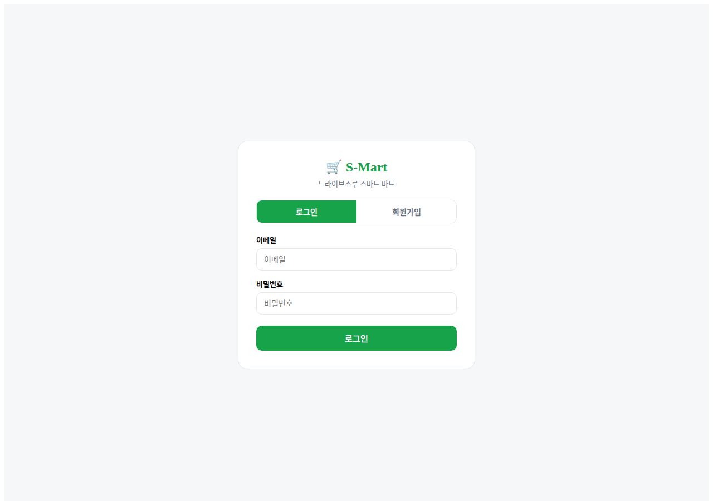
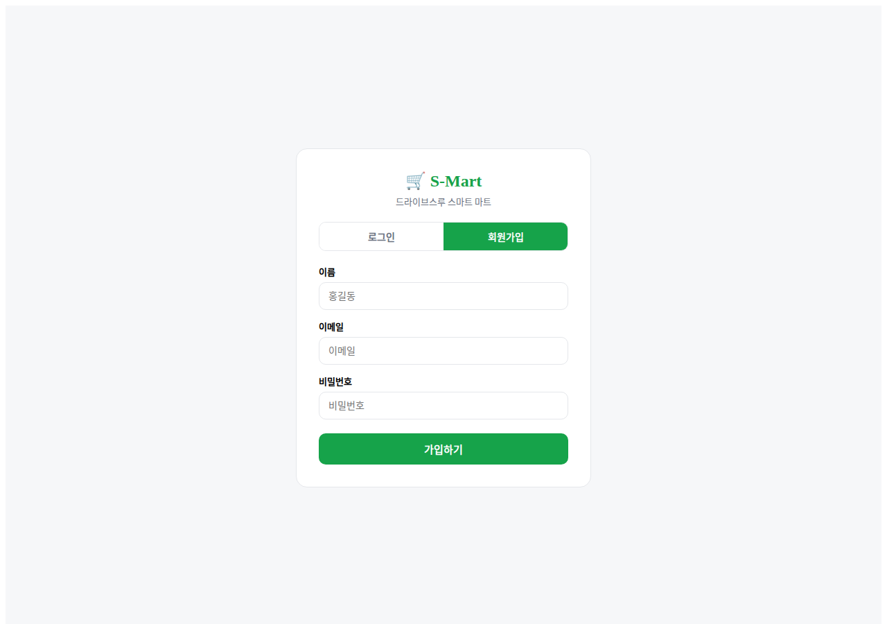
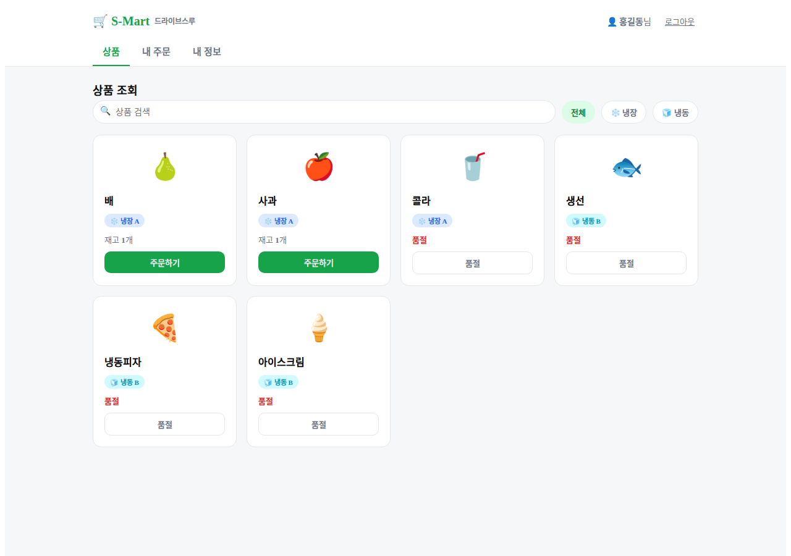
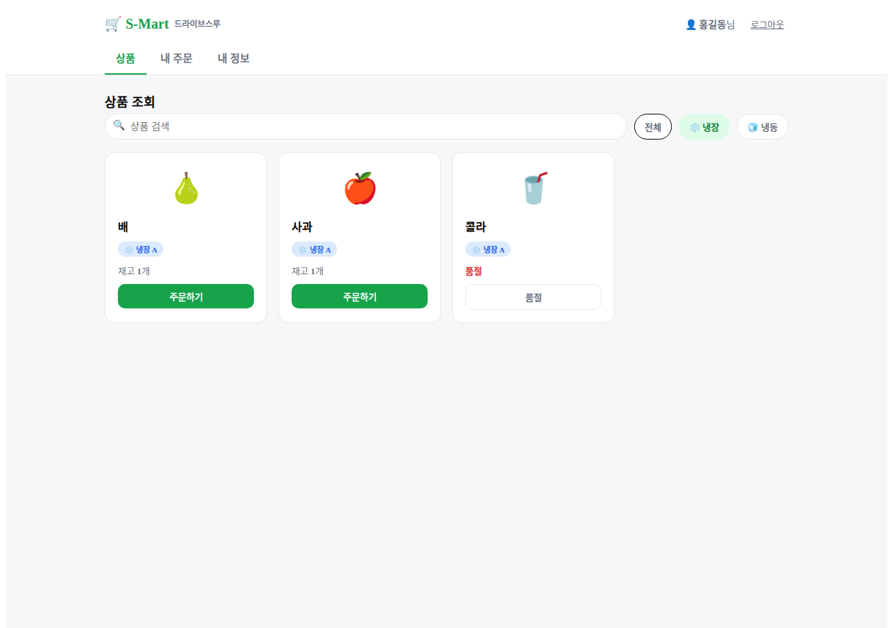
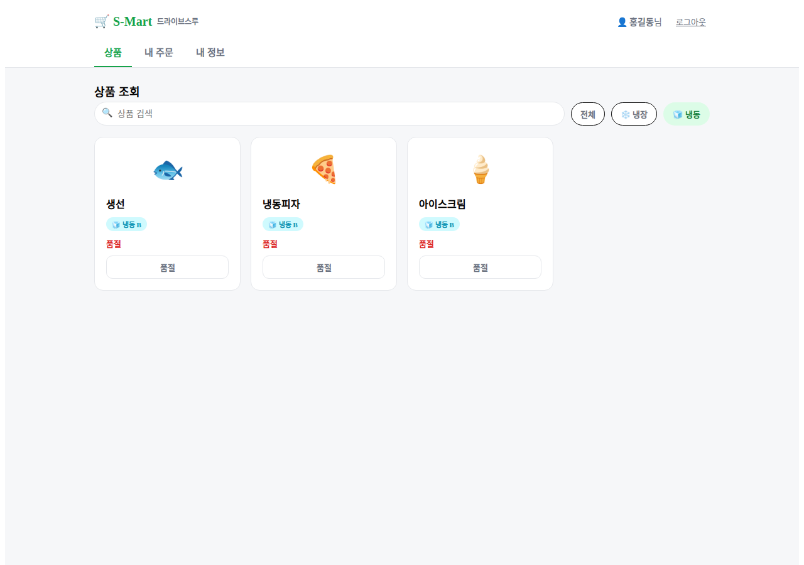
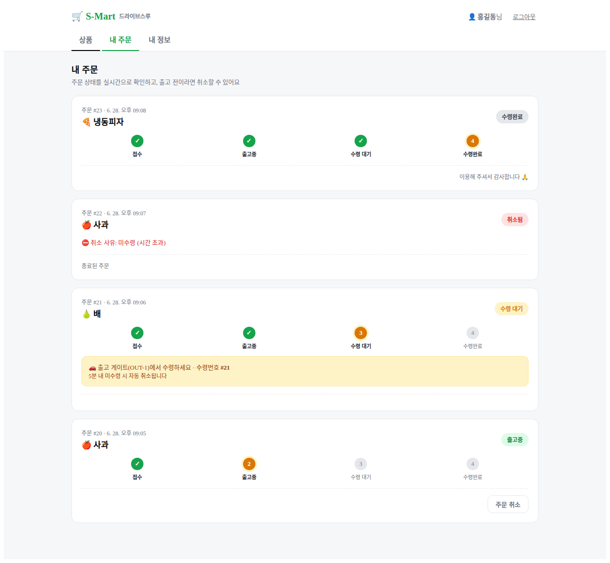
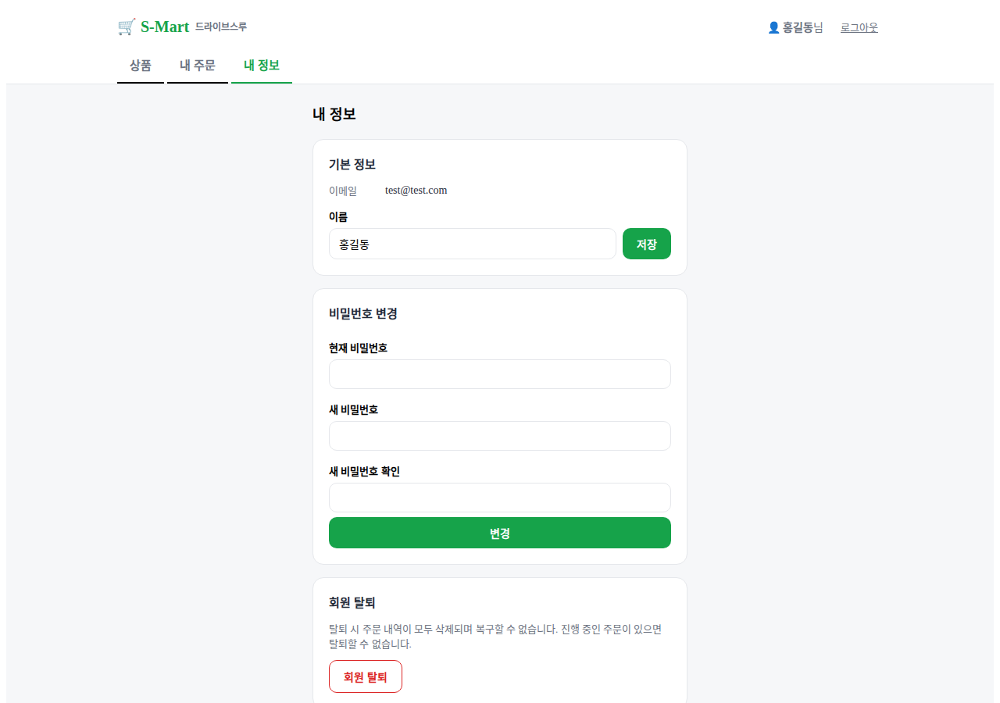

# 📱 사용자 UI (Customer Web Portal)

> 무인 마트를 방문한 고객이 본인의 스마트폰이나 매장 키오스크를 통해 실시간 재고를 확인하고 주문할 수 있는 React 기반의 웹 애플리케이션입니다.

## ✨ 주요 기능 및 화면 (4 Pages)

본 애플리케이션은 사용자 계정 관리를 포함하여, 상품 주문 및 배송 상태를 **WebSocket을 통해 실시간으로 업데이트**하는 총 4개의 핵심 페이지로 구성되어 있습니다.

### 1. 로그인 페이지 (LoginPage)



- 고객이 시스템에 접속하기 위한 진입점입니다. 계정이 없는 신규 사용자는 회원가입을 통해 간편하게 계정을 생성할 수 있습니다.

### 2. 상품 정보 페이지 (CatalogPage)




- 마트에서 취급하는 상품들의 상세 정보(이름, 이미지, 재고 수량 등)를 실시간으로 확인하고 장바구니에 담을 수 있습니다. 
- 냉장/냉동 등 보관 타입에 따른 필터링 기능을 제공하여 원하는 상품을 쉽게 찾을 수 있습니다.

### 3. 주문 현황 페이지 (OrderPage)

- 현재 내가 주문한 상품을 로봇이 가져오고 있는지 출고 상태를 실시간(WebSocket)으로 추적합니다.
- 상품이 출고지에 도착하여 수령 가능 상태가 되기 전까지는 주문 취소가 가능합니다.
- **자동 타임아웃 기능**: 출고지에 도착한 상품을 일정 시간 동안 수령하지 않으면, 시스템이 자동으로 주문을 취소하고 환불 처리한 뒤 로봇이 상품을 다시 창고로 반납(Reclaim)합니다.

### 4. 내 정보 페이지 (ProfilePage)

- 사용자 계정에 대한 기본적인 정보 조회 및 관리가 가능합니다. (계정 CRUD 지원)
- 현재 등록된 이름, 비밀번호 등의 개인 정보를 수정하거나, 필요시 회원 탈퇴 처리를 진행할 수 있습니다.

<br/>

## 📁 디렉터리 구조
```text
client/
├── docs/                  # README 캡처 이미지 등 문서 데이터
├── public/                # 정적 에셋 파일
├── src/                   # React 소스 코드
│   ├── api/               # FastAPI 백엔드 연동 및 API 호출 로직
│   ├── hooks/             # WebSocket 연결 및 상태 관리용 커스텀 훅(Hooks)
│   ├── pages/             # LoginPage, CatalogPage, OrderPage, ProfilePage 모듈
│   ├── App.tsx            # 메인 앱 라우팅 및 전역 상태 관리
│   ├── main.tsx           # React 애플리케이션 진입점 (렌더링)
│   ├── constants.ts       # 전역 상수 정의
│   └── types.ts           # TypeScript 타입 및 인터페이스 정의
├── index.html             # 메인 HTML 템플릿
├── package.json           # 프론트엔드 의존성 패키지 관리
├── tsconfig.json          # TypeScript 설정 파일
└── vite.config.ts         # Vite 빌드 도구 설정 파일