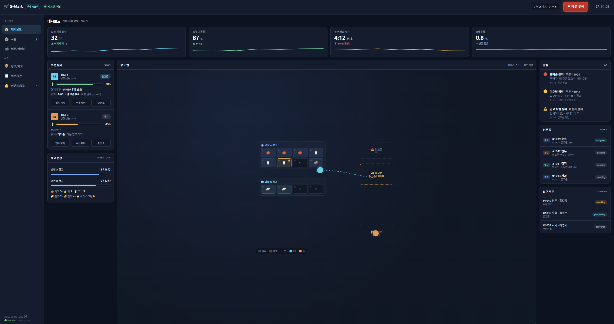
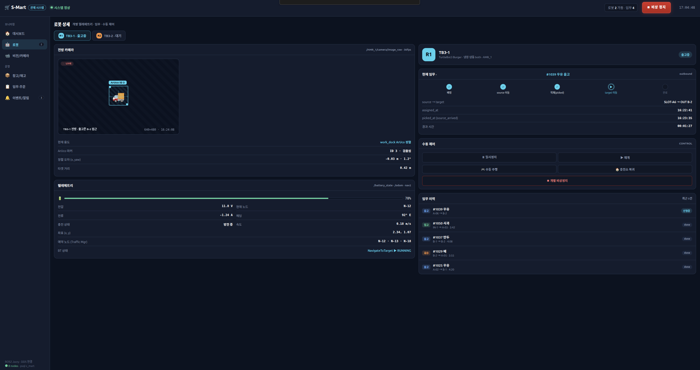
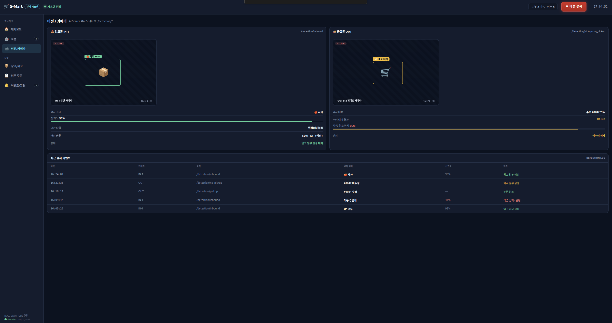
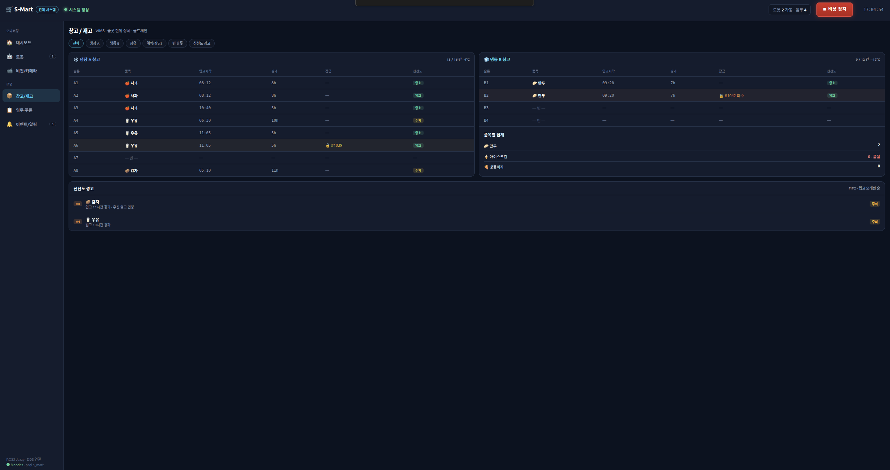
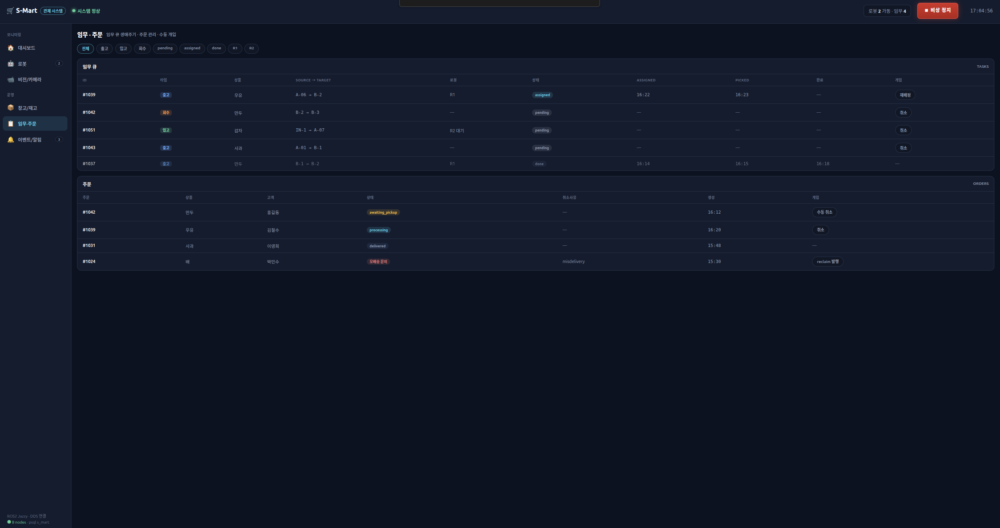
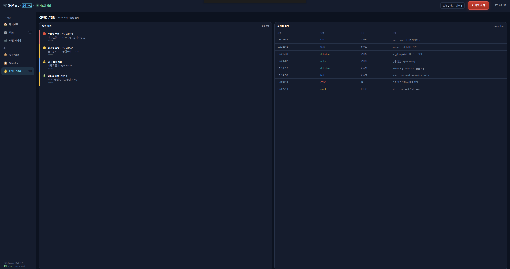

# 🛒 관제 UI (Admin GUI)

> 시스템 전체 현황을 모니터링하고 다중 로봇(AMR)과 창고 재고를 통합 제어하는 관리자용 데스크톱 애플리케이션(PyQt5)입니다.

## ✨ 주요 기능 및 화면

### 1. 메인 대시보드

- 지도를 중심으로 시스템 전체 상태를 한눈에 파악할 수 있는 종합 모니터링 화면입니다. 동적 맵 렌더링을 통해 로봇의 실시간 위치와 주요 지표를 직관적으로 제공합니다.

### 2. 로봇 상세 페이지

- 개별 로봇의 세부 상태를 정밀 모니터링하고 제어합니다. 전방 카메라 비전 뷰, 현재 임무 상태, 임무 로그를 확인할 수 있으며 비상시 긴급 제어를 수행할 수 있습니다.

### 3. 입/출고존 페이지

- 현재 입/출고존에 위치한 상품의 존재 여부 및 품목을 실시간으로 확인하고, 과거의 감지 이력들을 로그 형태로 시각화하여 제공합니다.

### 4. 재고 관리 페이지

- 냉장/냉동 창고 내 보관 슬롯별 현재 재고 현황을 격자 형태로 보여주며, 상품별 입고 시각 등 재고 관리에 필요한 필수 데이터를 관리합니다.

### 5. 임무 관리 페이지

- 고객의 주문 테이블과 이에 따라 생성된 로봇 임무(Task)의 할당 및 진행 상태 로그 이력을 통합 관리합니다.

### 6. 이벤트 로그 페이지

- 상세 임무 현황, 로봇/서버 상태 변동 내역 등 시스템 전반에서 발생하는 모든 이벤트를 타임스탬프와 함께 기록한 로그 테이블입니다.

<br/>

## 📁 디렉터리 구조
```text
smart_gui/
├── __init__.py      
├── main.py            # 애플리케이션 진입점 및 GUI 초기화
├── map_view.py        # 동적 맵 렌더링, 로봇 마커 및 장애물 오버레이 위젯
├── ops_page.py        # 임무 주문 및 작업(Task) 관리 페이지
├── vision_page.py     # 다채널 비전 카메라 모니터링 페이지
├── panels.py          # UI 구성을 위한 공통 위젯 및 패널 모듈
├── theme.py           # GUI 테마 및 스타일 설정
├── ros_link.py        # rclpy 기반 ROS2 통신 및 로봇 상태 데이터 처리
├── db_link.py         # PostgreSQL DB 상태 연동 모듈
└── camera_link.py     # 카메라 영상 스트리밍 연동 모듈